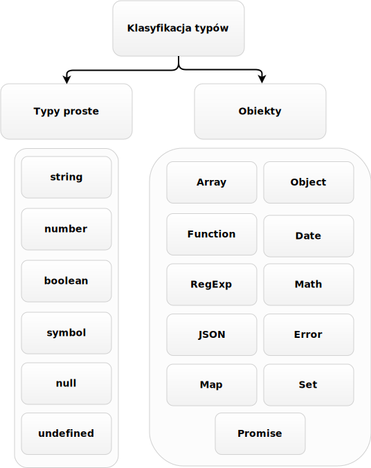

Co ma wspólnego dziecko trzymające balonik wypełniony helem z obiektami w JavaScript? Jakie wyróżniamy typy w JavaScript i czym się one charakteryzują? Odpowiedź na te pytania poznasz w dzisiejszym wpisie, który jest kontynuacją serii o podstawach JavaScript. Zapraszam do dalszego czytania.

### Czego się dzisiaj dowiesz?
W poprzednim wpisie z tej serii poznawaliśmy rodzaje zmiennych, różnice między nimi oraz ich zastosowania. Wiesz już, że w JavaScript zmienne nie mają typów i możesz do nich przypisać każdą wartość. Dlatego to właśnie wartości w JavaScript mają typy (mówimy, że dana wartość jest określonego typu), a dzisiejszy wpis ma za zadanie naświetlić Ci ich rodzaje i charakterystykę. Postaram się również zestawić ze sobą rodzaje typów aby łatwiej było Ci dostrzec najważniejsze różnice między nimi. Na sam koniec, zachęcam Cię do zmierzenia się z zadaniami jakie dla Ciebie przygotowałem. Pomogą Ci one utrwalić poznane dzisiaj zagadnienia.

### Główna klasyfikacja typów
W JavaScript typy możemy podzielić na proste i referencyjne (lub po prostu obiekty). Do typów prostych zaliczamy:
* *string*
* *number*
* *boolean*
* *symbol*
* *null*
* *undefined*

Do typów referencyjnych zaliczamy typ *object*. W dużym skrócie - wszystko co nie jest typem prostym jest obiektem. Poniżej przedstawiam w formie graficznej podział typów, z uwzględnieniem różnych rodzajów obiektów.



Jak widać rodzajów obiektów jest bardzo dużo, a i tak nie zamieściłem wszystkich, nie jest nam to dzisiaj potrzebne. Jeżeli jesteś bardzo ciekawy to [tutaj](https://developer.mozilla.org/en-US/docs/Web/JavaScript/Reference/Global_Objects) możesz sprawdzić wszystkie istniejące rodzaje obiektów w JavaScript.

Jak już wspomniałem we wstępie, w JavaScript to wartości, a nie zmienne posiadają typ. Przykładowo, do zmiennej let możemy przypisać wartości które mogą mieć typ string, number, object itd. Zmienna let sama w sobie nie ma określonego typu, ale wartość którą ona przechowuje już typ posiada.

Jeżeli chcemy sprawdzić, jaki typ został przypisany do danej zmiennej, możemy posłużyć się operatorem `typeof`. Zerknij na poniższy kod.
```javascript
const a = 1;
const b = '1';
const c = true;
const d = { javaScript: 'is awesome' };
const e = null;

console.log(typeof a); // number
console.log(typeof b); // string
console.log(typeof c); // boolean
console.log(typeof d); // object
console.log(typeof e); // object (jest to znany JavaScriptowy błąd, który nie może być poprawiony ze względu na kompatybliność wsteczną, oczekiowanym rezultatem powinna być tu wartość null, a nie object)
```
Jak widzisz, na samym początku zainicjalizowaliśmy zmienne a, b, c, d, e różnymi typami wartości. Następnie typ wartości przypisany do każdej zmiennej wypisujemy w konsoli.

### Charakterystyka typów prostych
Główną cechą typów prostych jest to, że są porównywane i przekazywane poprzez **wartość**. Co to tak na prawdę oznacza?

#### Porównywanie i przekazywanie przez wartość
Trochę teorii niestety trzeba liznąć. W przypadku typów prostych - zmienna przechowuje wartość i gdy porównujemy zmienne z wartościami typu prostego to tak na prawdę porównujemy wartości. Może się to wydawać oczywiste, ale zmienisz trochę punkt widzenia, gdy poznasz charakterystykę typów referencyjnych. Zerknij na przykład poniżej.
```javascript
const a = 10; // (1)
const b = 10; // (2)
console.log(a === b); // true (3)
```
Do zmiennej `a` przypisaliśmy wartość typu prostego *number* (1). Następnie do zmiennej `b` przypisaliśmy taką samą wartość typu prostego (2). Gdy porównamy obie zmienne ze sobą (=== to operator porównania identyczności o którym więcej będziemy mówić w innym wpisie), otrzymamy `true` - wartości w zmiennych są identyczne (3).
Dla przykłady sprawdźmy co się stanie gdy porównamy różne wartości typu prostego.
```javascript
const a = 10;
let b = 5;
console.log(a === b); // false (1)
b = 'dziesięć'; // (2)
console.log(a === b); // false (3)
```
Jak możesz zauważyć porównaliśmy dwie zmienne z różnymi wartościami typu prostego *number* i otrzymaliśmy informację, że nie są one identyczne (1). Następnie jednej zmiennej zmieniliśmy wartość z typu *number* na *string* (2) i po ponownym porównaniu obu zmiennych wynik nie mógł być inny niż negatywny (3).

Przeanalizujmy jeszcze jeden przykład, w którym omówimy sobie cechę przekazywania wartości w typach prostych.
```javascript
let a = 10;
let b = a;
console.log({b}); // 10 (1)
a = 5; // (2)
console.log({b}); // 10 (3) 
```
Inicjalizujemy zmienną `a` o wartości 10. Następnie do zmiennej `b` przypisujemy zmienną `a` i sprawdzamy jaka wartość jest przypisana do zmiennej `b` - konsola mówi nam, że jest to 10 (1).  W kolejnej lini zaczynamy eksperyment. Zmieniamy wartość przypisaną do zmiennej `a` na 5 (2) i sprawdzamy czy spowodowało to zmianę wartości w zmiennej `b` (3). Jak widzisz, zmienna `b` nadal posiada wartość 10 - co potwierdza cechę typów prostych, są one przekazywane poprzez wartość. I znów, może się to dla niektórych wydawać oczywiste, dopóki nie skonfrontujemy tego z cechami typów referencyjnych.

#### Modyfikowanie własności typów prostych
Typy proste, posiadają jeszcze jedną ważną cechę - nie możesz zmienić, dodać ani usunąć ich własności. O co chodzi? Popatrzmy na kolejny przykład.
```javascript
let a = 'tekst';
console.log(a.length); // 5 (1)

a.length = 3; // (2)
console.log(a.length); // 5 (3)

a.isEmpty = false; // (4)
console.log(a.isEmpty); // undefined (5)
```
Tu się zaczęły dziwne rzeczy co? Przypisaliśmy zmiennej `a` wartość typu *string*, a następnie wypisaliśmy w konsoli wartość własności `length` zmiennej `a` (1). Własność `length` dla wartości typu *string* przechowuje ilość znaków ciągu tekstowego. Jak pewnie już policzyłeś - słowo **tekst** zawiera 5 znaków czyli wszystko się zgadza. Co się stało potem? Próbowałem zmodyfikować własność `length` dla zmiennej `a` (2), ale jak się okazuje, taka operacja nie działa, własność `length` dalej ma tą samą wartość (3). Ostatnią czynnością była próba stworzenia nowej własności `isEmpty` zmiennej `a` i przypisania jej wartości `false` (4). Niestety, jest tak jak wspomniałem wcześniej. Dla typów prostych nie można modyfikować własności, terminal pokazuje nam `undefined` (5).  Dzieje się tak, ponieważ zmienna `a` nie posiada własności `isEmpty`. 

### Charakterystyka typów referencyjnych
Wiemy już, że wszystko co nie jest typem prostym, jest obiektem - czyli typem referencyjnym. Pierwszą cechą charakterystyczną dla tych typów jest to, że są przekazywane i porównywane poprzez **referencję**. No dobrze, ale czym tak właściwie jest ta **referencja**? Musisz to dobrze zrozumieć, dlatego postaram się przedstawić te zagadnienie jak najbardziej obrazowo. Brak pełnego zrozumienia będzie Cię później kosztował wiele nerwów i przelanego niepotrzebnie nad kodem potu. 

#### Referencja
Wyobraź sobie dziecko, które w dłoni trzyma sznurek do którego końca przyczepiony jest balonik z helem. Dziecko będzie symbolizowało naszą zmienną, balonik z helem będzie naszym obiektem, a sznurek przyczepiony do tego balonika będzie **referencją**. Dziecko ma balonik, ale nie trzyma go bezpośrednio w dłoni - trzyma go pośrednio przez sznurek. Sznurek jest referencją do konkretnego balonika. Zapamiętaj na potrzeby tego wpisu, że gdy w dalszej jego części będziemy porównywać sznurki, to tak na prawdę będziemy patrzeć na to, czy sznurki są przyczepione do tego samego balonika. Przenieśmy to teraz na bardziej techniczny grunt.

**Referencja** jest to adres pod którym fizycznie w pamięci zapisany jest obiekt. Oznacza to tyle, że jeżeli do zmiennej (dziecka) przypisujesz jakiś obiekt (balonik), to zmienna ta nie przechowuje w rzeczywistości tego obiektu (dziecko nie trzyma balonika bezpośrednio w dłoni), ale przechowuje adres - **referencję** (dziecko trzyma w dłoni sznurek) do miejsca w pamięci, w którym ten obiekt istnieje. Przyjrzyjmy się poniższym przykładom, by lepiej zrozumieć w czym rzecz.
```javascript
// Przypisanie obiektów do zmiennych
const a = { javaScript: 'is awesome' }; // (1)
const b = { javaScript: 'is awesome' }; // (2)
const c = a // (3)

// Porównywanie obiektów
console.log(a === b); // false (4)
console.log(a === c); // true (5)
```
Na samym początku przypisaliśmy zmiennej `a` obiekt  `{ javaScript: 'is awesome' }` (1). Następnie zmiennej `b` został przypisany identycznie wyglądający obiekt `{ javaScript: 'is awesome' }` (2). Później stworzyliśmy zmienną `c` do której przypisaliśmy zmienną `a` (3).  W kolejnych liniach dzieją się bardzo interesujące, a zarazem dziwne rzeczy. Najpierw sprawdzamy w konsoli, czy zmienne `a` i `b` posiadają te same wartości (4). Otrzymaliśmy wynik `false` - jakim cudem, skoro te obiekty wyglądają identycznie? 

Odpowiedzią na te zachowanie jest cecha typów referencyjnych - są one porównywane przez **referencję**, a nie przez wartość. Obiekty w zmiennych `a` i `b` to dwa różne byty, które zapisane są w różnych miejscach w pamięci. A więc referencje do tych dwóch bytów są różne i to właśnie one są porównywane. Przekładając to na przykład z dzieckiem mamy taką sytuację - dziecko `a` trzyma w ręku swój sznurek do balonika, ale jest również dziecko `b` trzymające sznurek do swojego balonika, który wygląda identycznie jak balonik dziecka `a`. Nie jest ważne, że balony wyglądają tak samo, ważne jest to, że fizycznie są to dwa balony i każdy z nich posiada swój przyczepiony sznurek. 

Zupełnie inaczej ma się sytuacja porównania zmiennych `a` i `c`, gdzie otrzymaliśmy wynik `true` (5). Aby to lepiej zrozumieć cofnijmy się do momentu, w którym do zmiennej `c` została przypisana zmienna `a` (3). Tak na prawdę, była to operacja skopiowania **referencji** przechowywanej w zmiennej `a` do zmiennej `c` (cecha przekazywania typów referencyjnych poprzez referencję). Oznacza to, że zmienna `c` przechowuje tą samą **referencję** co zmienna `a`. Analogia z dzieckiem będzie wyglądać następująco. Dziecko `a` trzyma swój balonik za sznurek. Dziecko `c` trzyma ten sam balonik co dziecko `a` ale za swój sznurek (idą obok siebie, trzymając dwa sznurki przyczepione do tego samego balonika z helem). Dzieci `a` i `c` fizycznie posiadają jeden balonik, można powiedzieć, że go współdzielą. Porównaliśmy ich sznurki (5) i wyszło nam, że są one przyczepione do tego samego balonika, stąd wynik `true`. 

Przeanalizujmy kolejny przykład, tym razem spróbujemy pozmieniać trochę obiekty przypisane do zmiennych.
```javascript
const a = { javaScript: 'is awesome' };
const b = a;

console.log(b); // {javaScript: "is awesome"}
a.javaScript = 'is universal'; // (1)
console.log(a); // { javaScript: "is universal" } (2)
console.log(b); // { javaScript: "is universal" } (3)
```
Na początku stworzyliśmy zmienną `a` do której przypisaliśmy obiekt, a następnie  zmienną `b` do której przypisaliśmy zmienną `a`. Sprawdzamy w konsoli na co wskazuje referencja zapisana w zmiennej `b` i tak jak się spodziewaliśmy, jest to ten sam obiekt na który wskazuje referencja ze zmiennej `a`.  W kolejnych liniach zaczynamy eksperyment. Zmieniamy obiekt spod zmiennej `a` (1). Następnie sprawdzamy w konsoli jak wygląda obiekt, do którego prowadzi referencja ze zmiennej `a`. Widzimy, że obiekt się zmienił (2). Teraz gwóźdź programu, sprawdzamy jak wygląda obiekt spod zmiennej `b` - nic przy niej jeszcze nie grzebaliśmy ;). Okazuje się, że obiekt przypisany do zmiennej `b` również został zmieniony (3)!

Co tam się zadziało? Chcieliśmy zmodyfikować obiekt w zmiennej `a`, a wyszło na to, że zmodyfikowaliśmy wszystkie obiekty - zarówno w zmiennej `a` jak i `b`. Sytuacja wygląda następująco. Po pierwsze, trochę Cię wprowadziłem w błąd pisząc, że zmieniliśmy wszystkie obiekty. Tak na prawdę zmieniliśmy jeden obiekt. Jest to po prostu częsty błąd myślenia o obiektach początkujących adeptów programowania. Zmienne `a` i `b` tak na prawdę przechowują **referencje** wskazujące na ten sam obiekt, współdzielą go. Zatem niezależnie czy modyfikujemy obiekt tak: `a.javaScript = 'is universal';` czy tak `b.javaScript = 'is universal';`, cały czas modyfikujemy ten sam obiekt. Zobrazujmy to teraz na przykładzie z dziećmi. Dziecko `a` i `b` trzymają po jednym sznurku, każdy sznurek przyczepiony jest do tego samego balonika. Dzieci współdzielą jeden balonik. Jeżeli jedno z dzieci domaluje swojemu balonikowi oczy, to drugie dziecko, czy tego chce czy nie, będzie współdzieliło balonik z domalowanymi oczami.

Referencje nie są prostym zagadnieniem i wielu początkujących ma problem z ich zrozumieniem. Mam nadzieję, że wszystko do tego miejsca jest dla Ciebie jasne, a jeżeli nie jest, przeanalizuj powyższe przykłady od początku. Uwierz mi, że znajomość tych mechanizmów to must have do bycia dobrym programistą. Przejdźmy teraz do kolejnej cechy typów referencyjnych, a jest nią domyślna możliwość dodawania, usuwania  i zmieniania własności. Napisałem domyślna, ponieważ możemy taką możliwość zablokować, ale jest to temat na inny wpis.

#### Modyfikowanie własności typów referencyjnych
Zacznijmy od razu od przykładu.
```javascript
const a = { javaScript: 'is awesome' };
a.javaScript = 'is universal'; // (1)
a.isModified = true; // (2)
console.log(a); // { javaScript: "is universal", isModified: true } (3)
delete a.javaScript; // (4)
console.log(a); // { isModified: true } (5)
```
Na samym początku tworzymy zmienną `a` i przypisujemy jej obiekt. Następnie modyfikujemy własność tego obiektu (1), a w kolejnej linii, dodajemy mu nową własność  (2). Po takich zabiegach nasz obiekt wygląda tak jak pokazuje konsola (3). Ma zmienioną wartość własności `javaScript` oraz dodaną nową własność - `isModified`.  Następnie za pomocą operatora `delete` usuwamy z obiektu własność `javaScript` (4) co potwierdza wynik w konsoli (5). Jak więc widzisz, obiekty są modyfikowalne i będziesz tę cechę bardzo często wykorzystywał w swoich programistycznych zmaganiach :).

### Porównanie typów prostych i referencyjnych
Czas na szybkie podsumowanie zdobytej wiedzy. Wymieńmy sobie zasadnicze różnice między typami prostymi i referencyjnymi.
 
* Typy proste są przekazywane i porównywane przez **wartość**, a typy referencyjne poprzez **referencję**
* Własności typów prostych nie są modyfikowalne w przeciwieństwie do własności typów referencyjnych.
* Wyróżniamy bardzo dużo rodzajów obiektów, dlatego łatwiej jest zapamiętać, że wszystko co nie jest typem prostym (string, number, boolean, symbol, null, undefined) - jest obiektem.

### Praca własna
Będę to powtarzał non-stop, znajomość teorii niepopartej praktyką jest nic nie warta - chyba, że chcesz filozofować na temat programowania. Zachęcam Cię, abyś przećwiczył to czego się dzisiaj dowiedziałeś. Jeżeli Twoim celem była nauka czegoś nowego, to samo czytanie o tym nie ma sensu.

**Ćwiczenie 1.** Poszczególne kroki opisane są w komentarzach kodu poniżej
```javascript
// Zainicjalizuj zmienne w następujący sposób
let a = 'javaScript';
const b = a;
 
// Co zobaczysz w konsoli i dlaczego?
console.log({b}); 
console.log(b.length);
console.log(typeof b);

// Zmieńmy teraz zmienną a
a = 'java';

// Co zobaczysz w konsoli i dlaczego?
console.log(a.length);
console.log(b.length); 
```

**Ćwiczenie 2.** Poszczególne kroki opisane są w komentarzach kodu poniżej
```javascript
// Zainicjalizuj następujące zmienne
const a = 'javaScript';
const b = { javaScript: 'is awesome', java: 'is not JavaScript' };

// Przprowadz następującą operację na zmiennych. Do czego służy operator delete?
delete a.length;
delete b.java;

// Co zobaczysz w konsoli i dlaczego?
console.log(a);
console.log(a.length);
console.log(b);
console.log(b.java);
```

**Ćwiczenie 3.** Co wyświetli się w konsoli i dlaczego?
```javascript
console.log('javaScript' === 'javaScript');
console.log('javaScript' === 'java');
console.log(1 === 1);
console.log(1 === -1);
console.log({ javaScript: 'is awesome' } === { javaScript: 'is awesome' });
```

**Ćwiczenie 4.** Poszczególne kroki opisane są w komentarzach kodu poniżej
```javascript
// Zainicjalizuj zmienne w następujący sposób
const a = { isModified: false };
const b = { isModified: false };
const c = b;
console.log(c) // co wyświetli konsola?

// Zmodyfikujmy zmienne a i b w następujący sposób
a.isModified = true;
a.javaScript = 'is awesome';
b.isModified = true;
b.javScript = 'is awesome';

// Co zobaczysz w konsoli i dlaczego?
console.log(a.javaScript);
console.log(a.isModified);
console.log(c);

// Usuńmy kilka własności z naszych obiektów
delete a.isModified;
delete c.javaScript;

// Co zobaczysz w konsoli i dlaczego?
console.log(a);
console.log(a.isModified);
console.log(b.javaScript);
```

### Bibliografia
1. Rauschamyer Axel, “JavaScript For Impatient Programmers”, Chapter 10 Values
2. Simpson Kyle, “You Don’t Know JS: Up & Going”, Chapter 2: Values,  [link](https://github.com/getify/You-Dont-Know-JS/blob/master/types%20%26%20grammar/ch2.md#chapter-2-values)
3. Rauschamyer Axel, “Speaking JavaScript”, Chapter 1 Basic JavaScript, [link](http://speakingjs.com/es5/ch01.html#_values)
