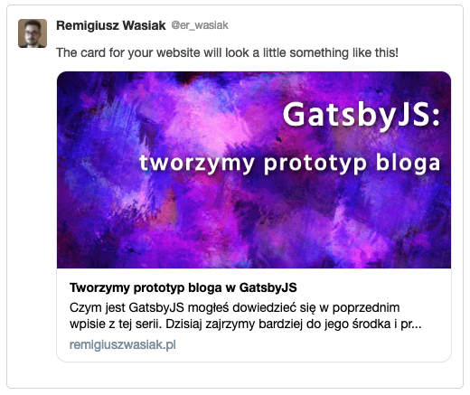

---
title: Podsumowanie lutego 2019
date:  '2019-02-28'
heroImg: './hero_summary_feb.png'
tags: ['podsumowania', 'informacje']
---
Przyszła pora na podsumowanie lutego 2019. To był ciężki miesiąc, na co w głównej mierze złożyły się sprawy prywatno-zawodowe. Natłok rzeczy do zrobienia niezwiązanych z blogiem był na tyle duży, że ciężko mi było zachować jakąś systematyczność w pisaniu. Jak zatem wyglądało życie bloga w tym miesiącu? Zapraszam do podsumowania 😉.

### Co udało się zrobić?
W lutym praca nad blogiem z różnych względów odbywała się głównie weekendami, jedynie ostatni tydzień był na tyle spokojny bym mógł podziałać coś więcej w ciągu tygodnia. Zobaczmy co udało się zrobić.

#### Trzy wpisy techniczne
Powstały 2 wpisy dotyczące podstaw JavaScript oraz 1 związany z GatsbyJS. Wszystkie dosyć obszerne. Nie zakładałem na ten miesiąc większej ilości wpisów.

#### Obrazki tytułowe w postach
Udało mi się dorobić wyświetlanie obrazków tytułowych w spisie postów, a także w każdym poście z osobna. Blog zaczyna dzięki temu wyglądać bardziej kolorowo i różnorodnie. Każda seria postów ma swój graficzny motyw przewodni.

#### Wyświetlanie miniaturek w social media
Dzięki dodaniu obrazków tytułowych do postów, mogłem poprawić wyświetlanie miniaturki widocznej przy udostępnianiu wpisu w social media. Od teraz nie będzie "biedy" z samym tekstem, wydaje mi się, że motyw graficzny jest czynnikiem mocno przyciągającym ludzką uwagę. Poniżej możecie zobaczy jak to się będzie prezentować w poszczególnych portalach społecznościowych.

Facebook:

Twitter:

#### System tagów
Ostatnią dużą aktualizacją, którą udało mi się zrobić jest system tagów. Zdecydowałem się na tagi zamiast kategorii. Uznałem że będą one dobrze spełniać swoją rolę, jeśli posty będą poprawnie tagowane. Tagi widoczne są zarówno w głównym widoku listy postów jak i w każdym poście z osobna (pod wpisem). Działają jak standardowe filtrowanie. Po kliknięciu w dany tag, wyświetlają nam się tylko takie posty, które są oznaczone danym tagiem 🙂.

### Plany na kolejny miesiąc
W następnym miesiącu planuję trochę zwolnić z widocznymi na zewnątrz zmianami i skupić się na poprawkach. Przez minione dwa miesiące działania bloga zaobserwowałem trochę problemów z indeksowaniem w wyszukiwarce Google oraz działaniem service worker'a. Trzy główne cele na marzec to:

#### Poprawa odświeżania zawartości bloga
Muszę dokładniej przyjrzeć się kwestii service worker'a w Gatsby oraz tego co i jak jest cache'owane. Fajnie, że blog działa offline, ale "lekko" irytujące jest oczekiwanie kilku sekund na załadowanie się nowych treści po wejściu na stronę główną. Jeśli nic z tym nie zrobię, współczynnik odrzuceń bloga będzie bardzo wysoki. Myślę, że rozwikłanie tego problemu może mi zająć sporo czasu.

#### Poprawa SEO
Drugą ważną kwestią jest poprawa SEO. Google Search Console znalazło mi trochę rzeczy do poprawy, na szczęście nie jest tego dużo. Poza tym, muszę rozeznać się trochę bardziej w temacie SEO, co mogę zrobić by lądować na wyższych pozycjach w wyszukiwarce.

#### Urozmaicenie zawartości postów
Ostatnią rzeczą, która być może będzie miała wpływ na wygląd tego co już istnieje będzie research tematu: jak Google ocenia atrakcyjności serwowanych treści. Być może mogę zrobić coś z tym, by serwowane przeze mnie treści były na conajmniej takim poziomie jak teraz, a jednocześnie były bardziej atrakcyjne dla robotów Google'a. Zobaczymy co z tego wyniknie.

### Trochę statystyk
Lubię patrzeć na liczby, szczególnie jak widzę progres 💪. W tym miesiącu statystki bloga przedstawiają się następująco (zakres czasowy 31.01.2019 - 28.02.2019):
1. Ilość unikalnych odsłon: 425
2. Ilość użytkowników: 65
3. Ilość napisanych słów: 6495

### Podsumowanie
W podsumowaniu stycznia postawiłem sobie następujące cele na miesiąc luty:
1. System kategorii i tagów
2. Promocja bloga

Dodałem system tagowania postów, natomiast z kategorii zrezygnowałem świadomie. Na chwilę obecną uznałem, że nie są mi one potrzebne. Cel pierwszym uważam za osiągnięty 💪. Jeżeli chodzi o promocję bloga to widać na podstawie ilości unikalnych odsłon, że ruch się zwiększa. Jednakże nie osiągnąłem tego w wyniku jakichś specjalnych działań marketingowych, szczerze powiedziawszy zabrakło mi na to czasu. Mimo wszystko udało mi się przygotować trochę grunt pod przyszłe działania promocyjne, jakim są np. miniaturki postów w social media. Cel promocji bloga, uważam za połowicznie osiągnięty, chociaż był on postawiony bardziej w formie rozeznania w temacie.

Biorąc pod uwagę ilość rzeczy na głowie jakie miałem w lutym, jestem MEGA zadowolony z efektów pracy nad blogiem. Ilość napisanych słów wzrosła z 4135 w poprzednim miesiącu do 6495 w obecnym. Życzę sobie by takie wolumeny słów utrzymywać w kolejnych miesiącach, jest to wysoko postawiona poprzeczka 🙃.

Jedyną rzeczą, która mi w tym miesiącu nie wyszła była częstotliwość wpisów. Co prawda zachowałem ilość z poprzedniego miesiąca, ale w ciągu dwóch środkowych tygodni nie działo się nic - nie miałem czasu by wszystko przygotować tak, żeby nadawało się do publikacji. Sporo nadrobiłem w ostatnim tygodniu. W marcu będę starał się ustabilizować daty publikacji postów.

Przed nami kolejny miesiąc, trzeba trzymać tempo. Do następnego razu!
