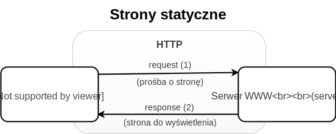
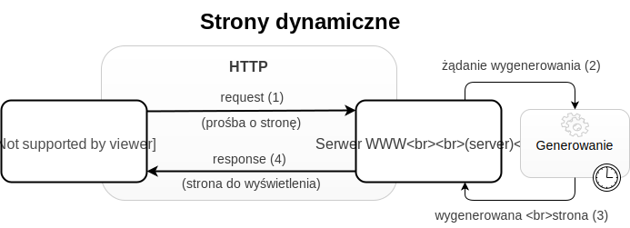
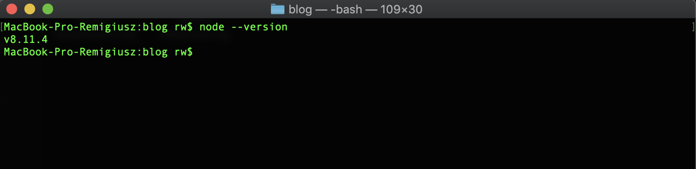
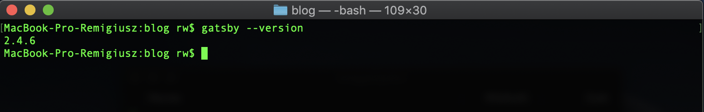
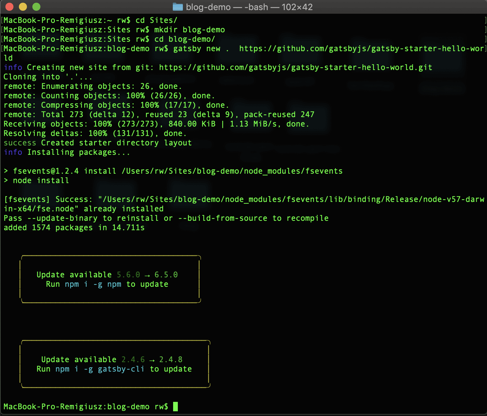
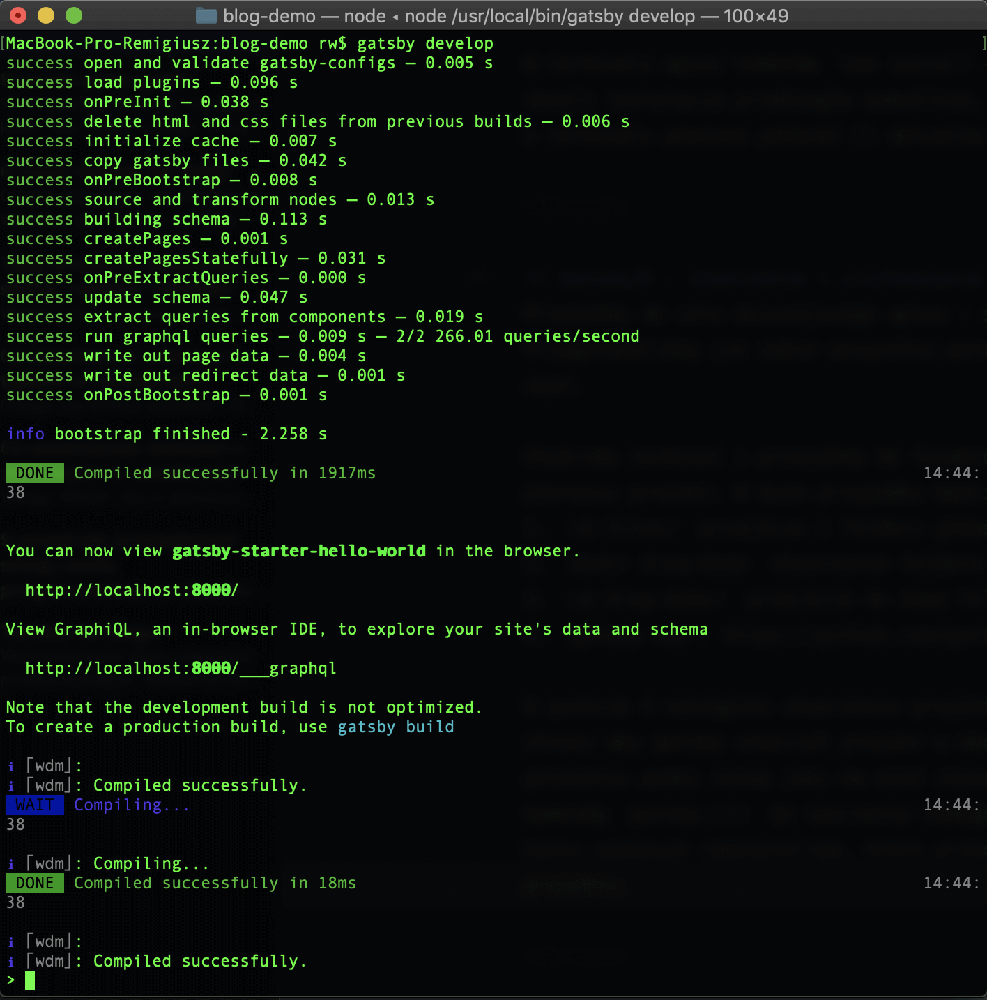
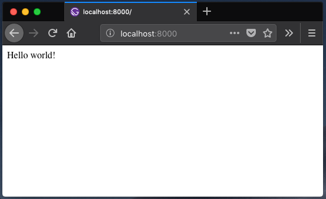

Jest to pierwszy post z serii o dokumentowaniu powstawania bloga. Dzisiaj opowiem Ci czym są strony statyczne i dynamiczne oraz dlaczego wybrałem właśnie GatsbyJS do budowy mojego bloga. Przygotujemy również odpowiednie środowisko do pracy, uruchomimy pierwszy projekt, a także przyjrzymy się dostępnym starterom do wybrania. 

## Czym jest GatsbyJS?
GatsbyJS jest generatorem stron statycznych (jednym z wielu). Przetwarza pliki źródłowe i przygotowuje nam strukturę statycznych plików do wrzucenia na serwer. Takie rozwiązanie ma swoje wady i zalety, jednakże w przypadku tego bloga, zalety zdecydowanie przeważają nad wadami. Pozwól, że najpierw omówimy sobie czym są strony statyczne i dynamiczne, by mieć lepszy ogląd sytuacji.

### Strony statyczne vs strony dynamiczne
Żeby rozwinąć temat trzeba poznać podstawy działania Internetu, zrobię to w bardzo wielkim skrócie i zachęcam Cię byś poszukał dokładniejszych informacji na temat. Główne role w komunikacji w Internecie należą do przeglądarki internetowej (zwanej jako client) oraz serwera WWW (server). Komunikują się one za pomocą protokołu HTTP. Komunikacja ta polega na wysyłaniu przez przeglądarkę "HTTP requests" do serwera, który odpowiada poprzez " HTTP response". W takiej odpowiedzi serwera może znajdować się plik html strony, którą przeglądarka ma wyświetlić.
 
**Strony statyczne** znajdują się fizycznie na serwerze, dlatego w ich przypadku, serwer po otrzymaniu zapytania od przeglądarki od razu przesyła w odpowiedzi plik html.

W przypadku **stron dynamicznych**, zachodzi jeszcze jeden etap w opisanej wcześniej komunikacji. Serwer po otrzymaniu zapytania od przeglądarki, musi wygenerować plik html na podstawie danych które otrzymał od przeglądarki, a dopiero później wysłać go w odpowiedzi do przeglądarki.

Dzięki temu, że strony dynamiczne generowane są "na poczekaniu", mogą one być tak zaprojektowane, by generowały wygląd i funkcjonalności unikalne dla każdego użytkownika czy dla aktualnego stanu aplikacji. Przykładowo, logując się do sklepu internetowego wyświetlają Ci się rzeczy do kupienia, a obok nich informacja, czy dany produkt jest dostępny. Serwer przesłał stronę wygenerowaną na podstawie aktualnego stanu bazy danych. Jeżeli kupisz ostatnią sztukę jakiegoś przedmiotu w tym sklepie, innym użytkownikom, zostanie wygenerowana strona, w której obok danego przedmiotu pojawi się informacja o braku jego dostępności. W przypadku stron statycznych strona będzie się generowała zawsze w takiej postaci w jakiej umieścimy ją na serwerze.

Mogłoby się wydawać, że strony statyczne przez swój brak "dynamiki" są rozwiązaniem z poprzedniej epoki. No bo po co ich używać, skoro technologia daje nam bardziej zaawansowane możliwości? Punkt widzenia, zależy od punktu siedzenia ;) Jeżeli tworzymy aplikację internetową, to strony statyczne rzeczywiście nie poradzą sobie z takim zadaniem. Co innego, gdy chcemy stworzyć portfolio, wizytówkę firmową i inne tego typu strony skupiające się głównie na publikowaniu statycznych treści. W takich przypadkach, dynamiczne strony nie są nam potrzebne, wręcz mogą się okazać gorszym rozwiązaniem.

Strony statyczne cechują się przede wszystkim bardzo dużą szybkością ładowania oraz wysokim bezpieczeństwem. Strony dynamiczne, pomimo tego że często uzbrojone są w dodatkowe mechanizmy typu cache (możliwość zapisania stanu naszej strony / podstrony na serwerze), dzięki czemu serwer nie musi czekać na jej wyrenderowanie), mogą co najwyżej **próbować** osiągać podobne rezultaty szybkości. Dodatkowo, strony dynamiczne ze względu na mniejsze lub większe obcowanie z bazami danych, narażone są na większą ilość potencjalnych luk bezpieczeństwa, co w przypadku stron statycznych jest zdecydowanie ograniczone. 

### Dlaczego zdecydowałem się na GatsbyJS?
GatsbyJS nie jest CMSem typu Wordpress. Nie posiada panelu admina, gdzie można sobie wyklikać ustawienia, zainstalować pluginy czy opublikować stronę / post. Jest to trochę bardziej skomplikowane narzędzie, ale dla mnie jest tym co wpisuje się doskonale w moje kryteria wyboru. Nie znam PHP, znam za to trochę JavaScript - czyli środowisko Gatsby. Na tym mógłbym zakończyć moje uzasadnienie, ale gatsby oferuje znacznie więcej niż środowisko JavaScript.

GatsbyJS bardzo ułatwia budowanie strony o szybkim czasie ładowania oraz spełniającej standard PWA (Progressive Web App, w dużym skrócie jest to strona, która może działać bez połączenia z Internetem oraz bez przeglądarki internetowej). Jako narzędzie samo w sobie, GatsbyJS okraszony jest wieloma nowymi technologiami webowymi. Strony tworzone przy jego pomocy pisane są w React.js, a ich stylowanie może odbywać się na wiele różnych spososbów. Począwszy od nowszych metod takich jak CSS-in-JS, styled-components, CSS Modules, a skończywszy na starszych (co nie znaczy, że gorszych) - Sass, Less czy po prostu zwykłym CSS. Wszystkie skrypty naszej strony dzielone są na paczki przy pomocy Webpacka, a dane procesowane są przy pomocy GraphQL.

Dodatkowo, wokół GatsbyJS zbudowała się już dosyć pokaźna społeczność, dzięki której powstało bardzo dużo pluginów ułatwiających tworzenie pewnych rzeczy. Można wśród niech wymienić np. gatsby-plugin-react-helmet służący do tworzenia reactowego komponentu do zarządzania sekcją nagłówkową <head> w dokumencie html. Dzięki temu mamy możliwość stworzenia w łatwy sposób komponentu do implementacji SEO na naszej stronie i jej podstronach. Innym ciekawym pluginem jest gatsby-plugin-manifest, który po odpowiednim skonfigurowaniu tworzy specjalny plik manifestu dla naszej strony. Plik ten umożliwia użytkownikom najpopularniejszych przeglądarek na mobile zapisaywanie naszej strony na ekranie telefonu, dzięki czemu może ona zachowywać się podobnie do aplikacji natywnych. O kolejnych poluginach opowiemy sobie w następnych częściach tej serii, a teraz przejdźmy w końcu do pierwszych kroków w używaniu GatsbyJS.

## Przygotowanie środowiska i narzędzi
Pierwsze co musimy zrobić to przygotowanie środowiska i narzędzi do pracy nad blogiem / projektem. Będziemy potrzebowali **Node.js**, który jest środowiskiem uruchomieniowym dla JavaScript poza przeglądarką i w którym zbudowany jest GatsbyJS. Potrzebny nam będziesz również **git**, którego GatsbyJS używa "pod spodem" do instalacji starterów i pluginów. Do tego wszystkiego zainstalujemy jeszcze **CLI** Gatsby'ego (command line interface), aby móc łatwo tworzyć nowe projekty, uruchamiać je czy budować wersje produkcyjne.

### Instalacja Node.js
Na początku sprawdźmy czy masz zainstalowanego node'a w swoim systemie. Otwórz terminal, wpisz `node --version`, jeżeli nie pokaże Ci się wersja node'a to znaczy, że powinieneś go zainstalować.

W tym celu udaj się na [stronę Node'a](https://nodejs.org/en/) i ściągnij wersję odpowiadającą Twojemu systemowi. Następnie otwórz pobrany plik i podążaj za instrukcjami. Po skończonej instalacji zamknij i otwórz ponownie terminal, tym razem komenda `node --version` powinna pokazać Ci w konsoli wersję node'a, którą przed chwilą zainstalowałeś.

### Instalacja git
W przypadku instalacji gita, może przebiegać ona trochę inaczej w zależności od systemu na jakim pracujemy. W tym celu przejdź do poradnika znajdującego się [pod tym linkiem](https://www.atlassian.com/git/tutorials/install-git) i podążaj za wskazówkami dla Twojego systemu.

### Instalacja Gatsby CLI
Wraz z instalacją node'a otrzymaliśmy również dostęp do npm (node.js package manager). Dzięki niemu możemy instalować przy pomocy terminala "paczki", które są po prostu aplikacjami JavaScript mogącymi pełnić przeróżne funkcje. W taki właśnie sposób zainstalujemy gatsby CLI, które ułatwi nam tworzenie projektów w gatsby z poziomu terminala. 

W terminalu wpisz komendę `npm install --global gatsby-cli`.
Jeżeli instalacja przebiegła pomyślnie, komenda `gatsby --version` uruchomiona w terminalu powinna pokazać Ci aktualną wersję gatsby CLI.

## GatsbyJS - stworzenie i uruchomienie nowego projektu
Przejdźmy do celu dzisiejszego wpisu - stworzenia pierwszej strony w GatsbyJS. Przygotowaliśmy już sobie wszystkie potrzebne narzędzie, więc poraz ich teraz użyć.

Otwórzmy terminal i przejdźmy do folderu w którym chcemy utworzyć nasz pierwszy projekt. W moim przypadku będzie to:
1. `cd Sites/` przejście z folderu głównego do folderu Sites
2. `mkdir blog-demo` stworzenie folderu blog-demo
3. `cd blog-demo/` przejście do nowo folderu blog-demo
4. `gatsby new . https://github.com/gatsbyjs/gatsby-starter-hello-world` 

W punkcie 4 nastąpiło utworzenie projektu gatsby w folderze blog-demo (jeżeli chcesz aby gatsby utworzył projekt w dedykowany folderze, zamiast . w poleceniu podaj nazwę jaką ma mieć stworzony folder). Słówko `new` jest komendą gatsby CLI do tworzenia nowego projektu. Adres url podany na końcu komendy wskazuje repozytorium, które przechowuje kod dla naszego startowego projektu. To właśnie dlatego instalowaliśmy gita - gatsby dzięki niemu może klonować wskazane repozytorium z projektem do instalacji. 

5. `gatsby develop`

W punkcie 5 uruchamiamy wersję developerską naszego projektu, jeżeli wszystko poszło w porządku, powinniśmy otrzymać informację w terminalu o pomyślnym zakończeniu kompilacji. Zobaczmy jak to wygląda u mnie.

Widzimy, że kompilacja projektu przebiegła pomyślnie - "Compiled successfully". Gatsby wypisał nam w terminalu również adres pod którym możemy zobaczyć nasz projekt. Otwórzmy zatem przeglądarkę i zajrzyjmy pod wskazany adres: http://localhost:8000/

Naszym oczom powinien ukazać się tekst powitalny znany z pierwszych lekcji programowania - hello world. Właśnie uruchomiliśmy nasz pierwszy projekt w GatsbyJS, który jest póki co samym szkieletem dla czegoś, co ma dopiero powstać. 

### GatsbyJS startery
GatsbyJS oferuje jednak trochę więcej niż hello world, społeczność buduje dużo innych starterów, którym możemy się przyjrzeć i wybrać ten, który nam najbardziej odpowiada. Strona pod [tym linkiem](https://www.gatsbyjs.org/starters/?v=2) pokazuje listę wszystkich dostępnych starterów jakich możemy użyć. Daje możliwość przefiltrowania wyników uwzględniając interesujące nas kategorie. W moim przypadku posłużyłem się jedynie filtrem na kategorię **blog**. Przejrzałem kilka najpopularniejszych starterów i ostatecznie zdecydowałem się na **[gatsby-starter-blog](https://www.gatsbyjs.org/starters/gatsbyjs/gatsby-starter-blog/)**.

Starter który wybrałem jest bardzo podstawowym zbiorem kilku funkcjonalności niezbędnych do działania bloga. Zależało mi na tym, by móc szybko uruchomić wersję MVP (minimal viable product) - czyli taką, która pomimo tego, że będzie uboga, nada się do publikacji. Pozostałe startery były bardziej złożone, co wymagałoby ode mnie dłuższego przystosowywania ich do mojej koncepcji.
W kolejnych wpisach przedstawię Ci więcej szczegółów na temat działania GatsbyJS od środka - na przykładzie kolejnych etapów powstawania tego bloga.

## Podsumowanie
Jest mi niezmiernie miło, że udało Ci się dotrzeć do podsumowania :). Dzisiaj dowiedziałeś się, że GatsbyJS jest generatorem stron statycznych. Poznałeś także różnicę w działaniu stron statycznych i dynamicznych. Jeżeli jesteś osobą zainteresowaną używaniem GatsbyJS to mam nadzieję, że udało Ci się skonfigurować środowisko do pracy z gatsby i uruchomić swój pierwszy projekt. Do następnego razu!
