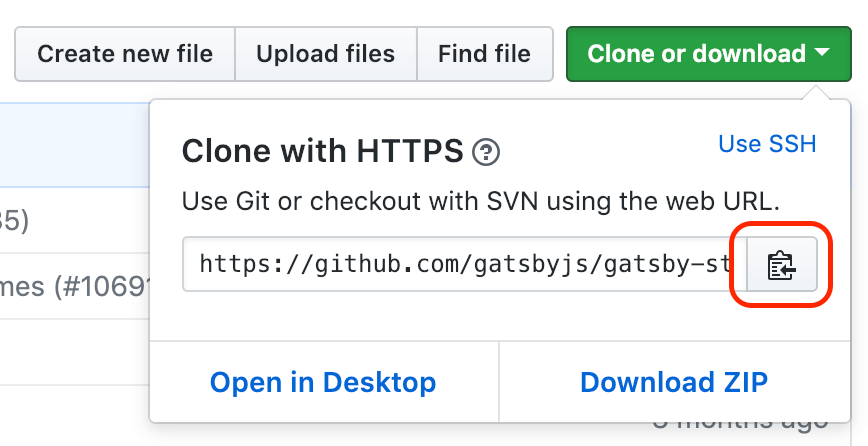
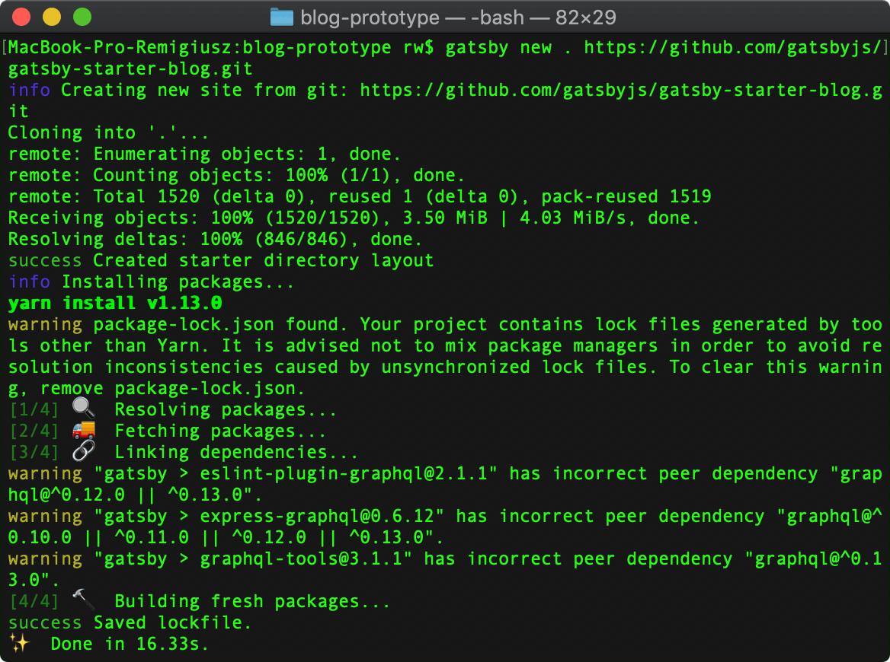
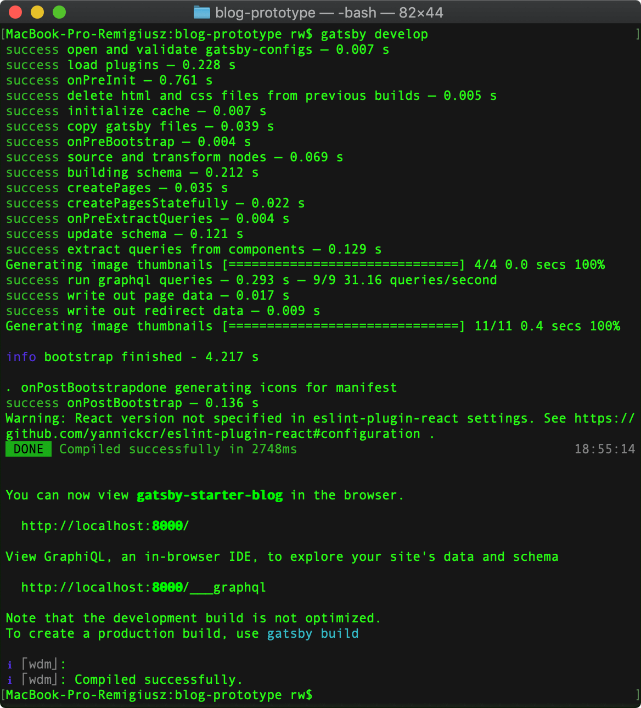

---
title: Tworzymy prototyp bloga w GatsbyJS - część 1
date: '2019-02-14'
---

Słowem wstępu.
### Instalacja startera gatsby-starter-blog

#### Krok 1 - kopiujemy adres do klonowania projektu
Przechodzimy do repozytorium gatsby-starter-blog i kopiujemy adres https.

#### Krok 2 - instalujemy starter
Instalujemy starter.

#### Krok 3 - uruchamiamy starter lokalnie
Uruchamiamy lokalnie wersję deweloperską projektu.
 

Otwieramy przeglądarkę i przechodzimy pod adres localhost:8000 gdzie możemy zobaczyć nasz działający starter.

### Omówienie zainstalowanych domyślnie pluginów

### Podsumowanie

