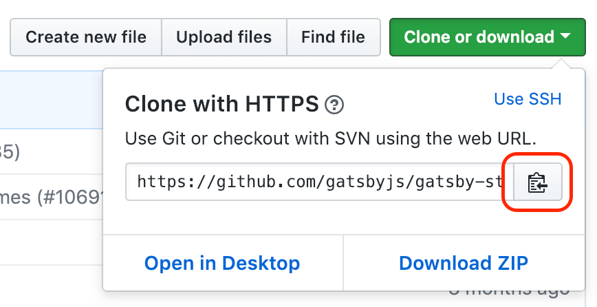
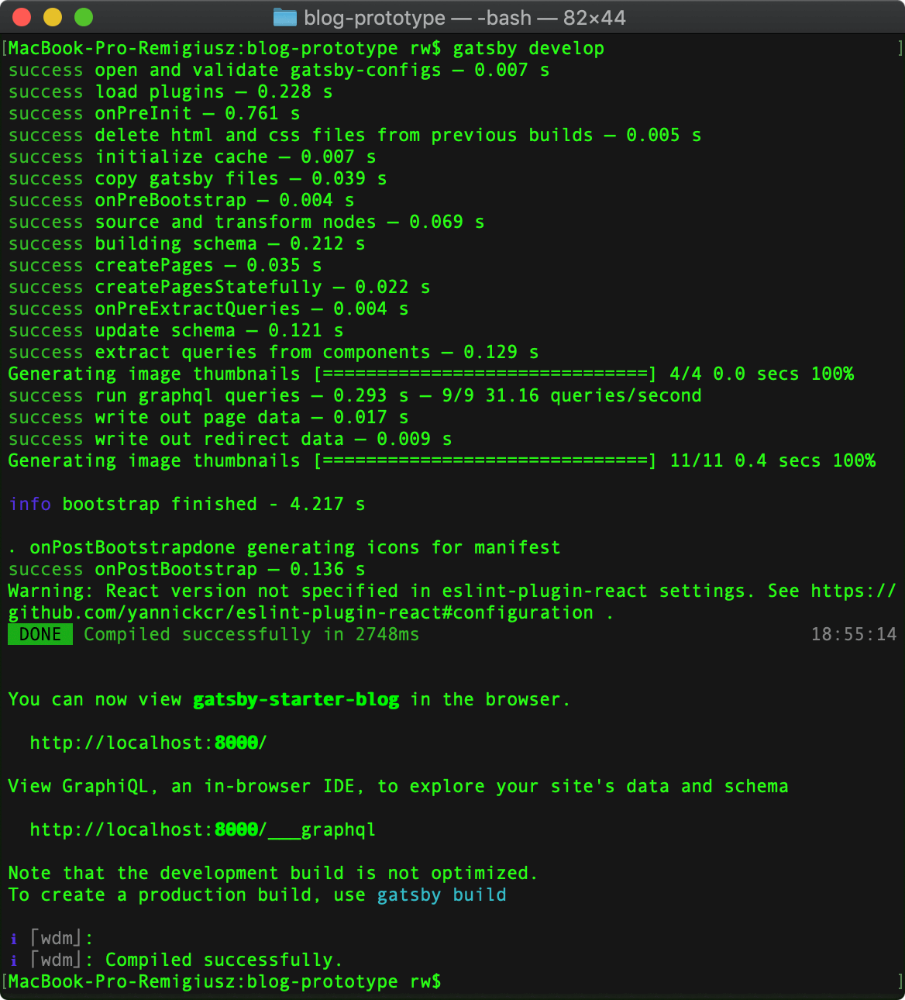
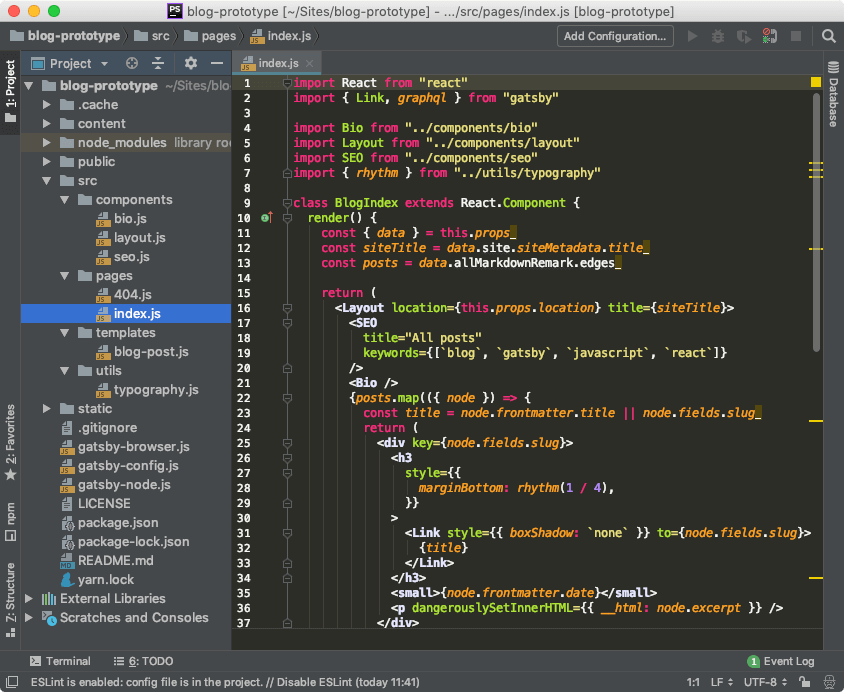

Czym jest GatsbyJS mogłeś dowiedzieć się w [poprzednim wpisie](/tworzenie-projektu-w-gatsbyjs-pierwsze-kroki/#czym-jest-gatsbyjs) z tej serii. Dzisiaj zajrzymy bardziej do jego środka i przeanalizujemy jak działa oraz co oferuje nam starter bloga od którego zaczniemy budowę naszej platformy. Zapraszam do dalszej lektury.

### Instalacja startera gatsby-starter-blog
Proces instalacji rozpoczniemy poprzez przejście do repozytorium w którym znajduje się wspomniany wcześniej starter. Możesz go znaleźć pod [tym adresem](https://github.com/gatsbyjs/gatsby-starter-blog).
Następnie wykonujemy następujące kroki.

#### Krok 1 - kopiujemy adres do klonowania projektu
Gdy już znajdujemy się w repozytorium projektu, musimy znaleźć i skopiować jego adres. Będzie nam on potrzebny w następnym korku. W tym celu klikamy w zaznaczony czerwonym kolorem przycisk, który w tym wypadku kopiuje nam adres url do projektu.

Jeżeli nie widzisz tekstu "Clone with HTTPS" tylko "Clone with SSH" to kliknij w link znajdujący się po prawej stronie z napisem "Use HTTPS". Github oferuje możliwość komunikowania się z repozytorium za pomocą ssh, ale wymaga to wygenerowania kluczy ssh na Twoim komputerze i dodania jednego z nich (publicznego) do Twojego profilu na Githubie. Jeżeli nigdy tego nie robiłeś to póki co korzystaj z komunikacji HTTPS.

Ok, mamy skopiowany adres, teraz możemy przejść do kolejnego kroku - instalacji naszego startera.

#### Krok 2 - instalujemy starter
Zanim zainstalujemy nasz starter, przygotujmy dla niego folder. W tym celu wykonałem poniższe czynności:
1. `cd ~/Sites` - przejście do folderu Sites
2. `mkdir blog-prototype` - stworzenie folderu blog-prototype
3. `cd blog-prototype` - przejście do folderu blog-prototype

Gdy przygotowaliśmy wszystko jak należy możemy rozpocząć instalację. Zerknij proszę na poniższą zawartość mojego terminala i zwróć uwagę na pierwszą linię.

Co przedstawia pierwszy wiersz terminala? Po pierwsze widać w nim, że znajduję się w folderze blog-prototype. Po drugie możesz zobaczyć, że użyłem komendy `gatsby new . https://github.com/gatsbyjs/gatsby-starter-blog.git`, która ni mniej, ni więcej służy do stworzenia nowego projektu przy użyciu skopiowanego wcześniej adresu do repozytorium startera. Jeżeli chcesz jeszcze dokładniejszego wyjaśnienia użytej komendy to zapraszam do [poprzedniego wpisu](/tworzenie-projektu-w-gatsbyjs-pierwsze-kroki/#gatsbyjs---stworzenie-i-uruchomienie-nowego-projektu), w którym rozłożyłem ją na czynniki pierwsze.

Kolejne wiersze w terminalu przedstawiają proces instalacji startera. Nie będziemy ich analizować na ten moment. Cieszymy się, że nie pojawiły się żadne błędy i że w ostatnim wierszu zobaczyliśmy informację "Done in 16.33s" - oczywiście w Twoim przypadku, instalacja może przebiec szybciej lub wolniej.

#### Krok 3 - uruchamiamy starter lokalnie
Po udanej instalacji projektu możemy w końcu spróbować go uruchomić. W tym celu używamy komendy `gatsby develop`, która uruchamia lokalnie nasz projekt. Zerknij na zrzut mojego terminala.

W pierwszym wierszu widzimy wspomnianą wcześniej komendę `gatsby develop`. Następnie, pomijając kroki które wykonuje gatsby by zbudować nasz projekt, widzimy napis **"DONE Compiled successfully in 2748ms"**. Oznacza on pomyślne zbudowanie projektu. Jeszcze niżej otrzymaliśmy także adres pod którym możemy zobaczyć nasz projekt. Otwieramy przeglądarkę i w pasku adresu wpisujemy localhost:8000.

Naszym oczom ukazuje się działający blog, możemy go przeklikać i popatrzeć jak działa. Pierwszy etap do uruchomienia własnego bloga za nami! W kolejnych etapach będziemy skupiać się na dostosowywaniu startera do naszych potrzeb :).

Zanim jednak przejdziemy do kolejnych etapów (co opiszę w następnych wpisach z tej serii), dobrze by było, gdybyśmy chociaż pobieżnie przyjrzeli się architekturze naszego bloga. Jak działa i z czego jest złożony.

### Szybka analiza architektury bloga
Spójrzmy na strukturę folderów naszego projektu.

#### Folder src
Zacznijmy od katalogu `src`. Zawarty jest w nim nasz projekt, który zawiera następujące foldery:
 - `components` - który przechowuje gotowe do użycia komponenty i w którym będziemy umieszczać nowe komponenty w trakcie rozwoju bloga. 
 - `pages` - który zawiera pliki ze stronami naszego bloga, póki co posiadamy stronę główną (index.js) oraz stronę 404 na wypadek gdy użytkownik będzie chciał dostać się do zasobu który nie istnieje.
 - `templates` - ten folder zawiera template'y, które możemy używać do generowania stron. Na ten moment mamy tam stworzony template posta naszego bloga. Dzięki temu template'owi każdy post na naszym blogu będzie miał taką samą strukturę. W momencie jakichkolwiek zmian dotyczących przekazywania danych, wystarczy że zmodyfikujemy nasz template, aby zmiany zostały zaaplikowane dla każdego posta na blogu.
 - `utils` - tutaj będziemy umieszczać pliki użytkowe. Na chwilę obecną znajduje się tam plik z konfiguracją typografii na naszym blogu.

GatsbyJS tworzy strukturę podstron projektu na podstawie wspomnianego wcześniej folderu `pages`. Gdy stworzymy tam kolejny plik zawierający React'owy komponent i nazwiemy go przykładowo second-page.js, będzie on widoczny jak kolejna podstrona naszego bloga - www.adres-bloga.pl/second-page.

#### Folder .cache
Folder `.cache` jest tworzony na potrzeby Gatsby'ego i używany tylko w środowisku developerskim naszego bloga. Zachowuje on tam sobie pliki potrzebne do skompilowania naszego projektu. Dzięki niemu, za każdym razem, gdy zmieniamy coś w naszym projekcie, gatsby nie musi kompilować wszystkiego od początku - podmienia tylko to, co zostało zmienione.

#### Folder content
Tutaj znajdują się pliki z naszymi postami oraz wszystkie obrazki jakie w nich zamieściliśmy. Jest to też miejsce na inne potrzebne nam obrazki np. logo naszego bloga. Z tego folderu Gatsby będzie pobierał treść naszych postów z plików markdown i transformował ją na dane umieszczane w React'owych komponentach. Wszystko to dzięki pluginom, o których będziemy sobie mówić w dalszej części tego wpisu.

#### Folder public
Jest to katalog w którym znajduje się wygenerowany przez Gatsby projekt w wersji produkcyjnej. Gdy użyjemy komendy `gatsby build` właśnie w tym miejscu wygeneruje się nasz działający projekt. Możemy go umieścić na jakimś hostingu i pokazać publicznie światu 😊.

#### Folder static
Jest to specjalny folder, którego zawartość kopiowana jest w trakcie budowania projektu i umieszczana w folderze public bez żadnego przetwarzania przez Gatsby'ego. Wg. dokumentacji, folder ten powinien być używany jako możliwość obejścia rzadko występujących problemów np. użycie biblioteki, która nie jest kompatybilna z Webpackiem (narzędzie do przetwarzania i optymalizacji naszego projektu, więcej informacji [tutaj](https://www.nafrontendzie.pl/podstawy-konfiguracji-webpack)) i którą umieszczamy na naszej stronie za pomocą znacznika `<script>`. 

#### Plik gatsby-config.js
W tym pliku znajduje się cała konfiguracja naszego projektu. W chwili obecnej znajdują się tam metadane naszej strony, takie jak: tytuł, autor, opis itd. Jest to po prostu obiekt przypisany do właściwości `siteMetadata`. Oprócz metadanych, plik ten zawiera wszystkie zainstalowane pluginy ze wstępną konfiguracją, które będą używane w projekcie. Gdy w przyszłości doinstalujemy kolejny plugin, będziemy musieli umieścić go w tym pliku i jeśli zajdzie potrzeba, ustawić mu odpowiednie parametry - aby działał tak jak chcemy. Wszystkie pluginy umieszczone są w tablicy przypisanej do właściwości `plugins`. Poza dwoma wymienionymi opcjami, możemy w tym pliku skonfigurować jeszcze inne ustawienia np. `pathPrefix` czy `polyfill`, nie będę jednak aż tak głęboko wchodził w temat. Nas na chwilę obecną najbardziej interesują pluginy i metadane, w kolejnych wpisach będę pokazywał jak i dlaczego je modyfikowałem.

#### Plik gatsby-node.js
W tym miejscu umieszczone są bardziej skomplikowane rzeczy, które wykonywane są w trakcie budowania naszego projektu. To co będzie nas interesować to proces tworzenia stron naszego bloga. Właśnie w tym pliku, przy pomocy operacji takich jak `createPages` możemy pobrać dane np. z bazy, a następnie stworzyć stronę do której te dane przekażemy. Tak  jak w przypadku pliku `gatsby-config.js`, w kolejnych wpisach opowiemy sobie co i dlaczego zostało zmodyfikowane by powstał blog, który właśnie czytacie 😊.  Napomknę tylko, że gdy w tym momencie zajrzysz do środka tego pliku, zobaczysz jak skonfigurowane jest pobieranie danych z plików markdown (w nich będziemy pisać posty) - bardzo fajna sprawa co?  😎

#### Plik  gatsby-browser.js
Tutaj będą znajdować się wszystkie rzeczy jakie chcielibyśmy, aby wykonywały się w przeglądarce po rozpoczęciu ładowania naszej strony. Na chwilę obecną widzimy tam tylko import krojów pisma używanych w projekcie, aby przeglądarka mogła je poprawnie wyświetlać. Tutaj będziemy mogli odpowiadać na różne zdarzenia jakie zajdą w przeglądarce - np. gdy użytkownik przejdzie z jednej podstrony na drugą - będziemy mogli taki moment wychwycić i zarejestrować ten fakt przy pomocy google analytics.

### Omówienie zainstalowanych domyślnie pluginów
Ostatnią kwestią, którą dzisiaj omówimy są pluginy domyślnie zainstalowane w naszym projekcie. To gdzie je możemy znaleźć już wiesz - jest to pliczek `gatsby-config.js`. Zobaczymy co mamy w środku, a dokładniej co znajduje się w tablicy przypisanej do właściwości `plugins`.

#### gatsby-source-filesystem
Jest to plugin do wyciągania danych z folderów naszego projektu, które potem mogą być przetwarzane przez kolejne pluginy dla konkretnych typów danych. Możemy zauważyć, że ten plugin w konfiguracji został użyty dwukrotnie - pierwszy raz dla ścieżki prowadzącej do katologu `blog`, a drugi do katalogu `assets`. Jeżeli zechcemy dodać kolejne katalogi, robimy to w sposób analogiczny - dodając po raz kolejny plugin z odpowiednią ścieżką.
#### gatsby-transformer-remark
Ten plugin odpowiada za parsowanie (to takie tłumaczenie czegoś na coś) danych wyciągniętych przez `gatsby-source-filesystem` które pochodzą z plików markdown by można było z nich utworzyć ich reprezentację  w formacie html. Plugin ten posiada kolejne pluginy, które możemy w nim zamieścić, a są nimi na chwilę obecną:
1. `gatsby-remark-images` - który odpowiada za to, by obrazki który umieściliśmy w pliku markdown były responsywne. To co robi ten plugin za nas jest niesamowite. Między innymi dba o przeprocesowanie obrazków dla różnych wielkości ekranów, dzięki czemu zapobiega ładowaniu wielkich obrazków na małe ekrany.
2. `gatsby-remark-reponsive-iframe` - odpowiada za odpowiednie skalowanie iframe'ów lub video na stronie, jeśli takowe znajdują w plikach markdown
3. `gatsby-remark-prismjs` - odpowiada za możliwość kolorowania składni bloków kodu transformowanych z markdown do html
4. `gatsby-remark-copy-linked-files` - odpowiada za kopiowanie zasobów (np obrazków) znajdujących się w markdown do folderu public, żeby mogły być wyświetlone na naszej stronie
5. `gatsby-remark-smartypants` - służy do parsowania znaków, ciężko to opisać w jakiś krótki sposób - najlepiej zobaczyć pod [tym linkiem](https://retextjs.github.io/retext-smartypants/) 🙂.

#### gatsby-transformer-sharp
Służy do procesowania obrazków pozyskanych uprzednio np. przez `gatsby-source-filesystem`. Dzięki niemu możemy mieć dostęp do obrazków z poziomu zapytań z GraphQL w naszych komponentach.

#### gatsby-plugin-sharp
Jest to pomocniczy plugin dla innych pluginów, ułatwiający procesowanie obrazków różnych formatów.

#### gatsby-plugin-google-analytics
Jak łatwo się domyślić, tym pluginem możemy skonfigurować i osadzić Google Analytics na naszej stronie.

#### gatsby-plugin-feed
Ten plugin służy do generowania pliku rss.xml dzięki któremu, nasz blog może być subskrybowany przez wszelakie czytniki RSS.

#### gatsby-plugin-manifest
Dzięki temu pluginowi generowany jest plik `manifest.websitemanifest` w katalogu głównym naszej strony. Plik ten umożliwia użytkownikom przeglądającym naszą stronę w przeglądarce urządzeń mobilnych na "zainstalowanie" (w pewnym sensie) naszej strony na swoim urządzeniu. Przykładowo, po takiej "instalacji" możliwe będzie otworzenie strony z poziomu desktopu urządzenia, co więcej, sama strona będzie mogła się pokazać w formie przypominającej natywną aplikację mobilną - niesamowite 🤩.

#### gatsby-plugin-offline
Jest to kolejny plugin, który robi ekstra rzeczy na naszej stronie - odpowiada za stworzenie service worker'a. No a czym jest ten service worker? W dużym skrócie, jest to taki skrypt JavaScriptowy, który pozwala na działanie naszej strony nawet gdy jesteśmy offline. Dodatkowo, taki service worker pozwala na obsługę "push notifications". Użytkownik może zasubskrybować lub odsubskrybować się  z otrzymywania notyfikacji z naszej strony (czy to w przeglądarce komputera czy na swoim urządzeniu mobilnym). To brzmi jak pomysł na wysyłanie notyfikacji do użytkowników z subskrypcją o nowym wpisie na naszym blogu 😉!

#### gatsby-plugin-react-helmet
Jest to plugin potrzebny Gatsby'emu do wspierania komponentu React Helmet. Pozwala on kontrolować sekcję `head` naszej strony przy pomocy reactowych komponentów. Dzięki niemu stworzony został komponent `seo.js` (zerknij do folderu /src/components) odpowiedzialny za odpowiednie generowanie w sekcji head meta tagów, słów kluczowych, tytułu strony i innych rzeczy związanych z SEO.

#### gatsby-plugin-typography
Plugin do obsługi biblioteki `typography.js`, dzięki czemu możemy zastosować spójne zestawienie rodzaju i wielkości fontów, interlinii, kolorów oraz innych parametrów wpływających na to jak będzie prezentował się tekst na naszej stronie.

### Podsumowanie
Jeżeli podjąłeś próbę instalacji startera bloga to mam nadzieję, że się ona powiodła. Jeżeli coś poszło nie tak, pisz w komentarzu - postaram się pomóc. Dzisiaj poznaliśmy podstawowe mechanizmy działania GatsbyJS - generowanie struktury podstron na podstawie folderu `pages`, konfiguracja pluginów w `gatsby-config.js`, pobieranie danych w `gatsby-node.js` czy definiowanie akcji wykonywanych w przeglądarce po rozpoczęciu ładowania strony w `gatsby-browser.js`. Oprócz tego, przyjrzeliśmy się wszystkim zainstalowanym pluginom - warto jest wiedzieć do czego służą rzeczy których się aktualnie używa 😄. Na dzisiaj to tyle, do następnego razu!
